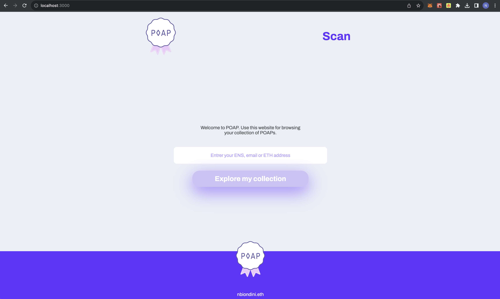
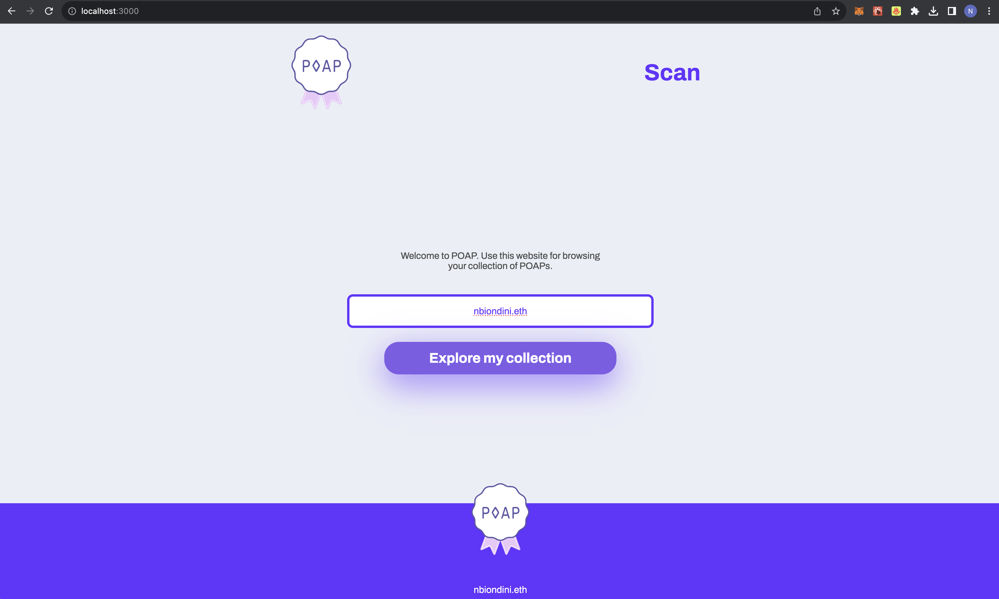
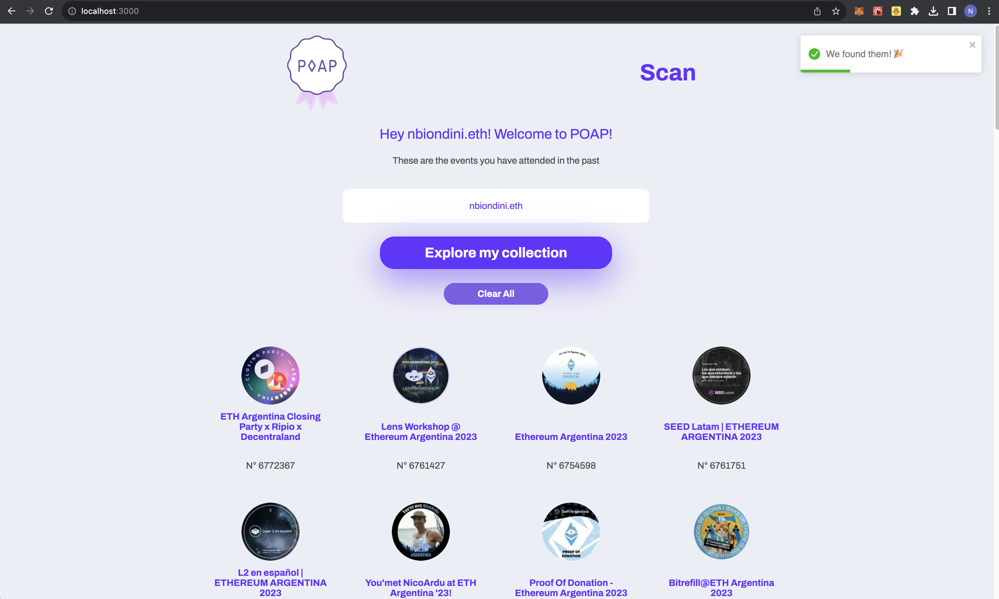
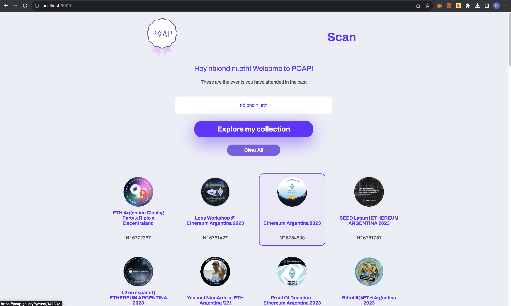

 

## POAP Scan project

**Introducing POAP Scan:** Explore your unique POAP token collection effortlessly with our Next.js-powered platform. Whether you enter your ENS, ETH Address, or email, our user-friendly tool provides a visually appealing showcase of your event mementos, securely stored on the blockchain for authenticity assurance. Unlock the memories of your attended events today!

Clone the project

    git clone git@github.com:NicolasBiondini/POAP-Project.git

Install dependencies

    npm install

Run the project

    npm run dev

